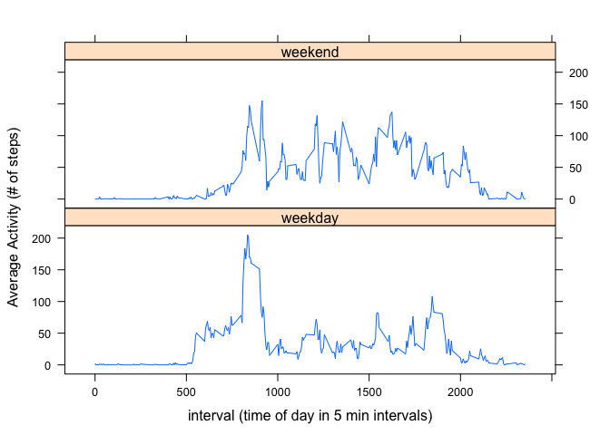

# Reproducible Research: Peer Assessment 1


## Loading and preprocessing the data
The following packages are required for procesing this data and will be loaded silently if not already loaded.

```r
suppressWarnings(suppressMessages(require(lubridate)))
suppressWarnings(suppressMessages(require(dplyr)))
suppressWarnings(suppressMessages(require(lattice)))
```

The data is loaded from the activity.csv file (already in this folder)
The only pre-procesing done is to convert the dates to a date format rather than a string.

```r
TheColumns <- c("numeric","character", "numeric")
activitydata <- read.csv("activity.csv",colClasses=TheColumns)
activitydata$date<- as.Date(activitydata$date, format= "%Y-%m-%d")
```

## What is mean total number of steps taken per day?
To answer this question the total steps taken every day will be calculated and simple histogram will be presented:  


```r
TotalStepsPerDate <- aggregate(steps~date, data=activitydata, FUN=sum, na.rm=TRUE) 
hist(TotalStepsPerDate$steps, xlab="Total steps a day", main="Histogram of Total Steps a Day")
```

 

```r
MeanTotalSteps <- mean(TotalStepsPerDate$steps) 
MedianTotalSteps <-median(TotalStepsPerDate$steps)
```
The mean total steps per day is 10766.19  and the Median total steps is 10765

## What is the average daily activity pattern?
To answer this question, a time series plot of the 5-minute interval (x-axis) and the average number of steps taken, averaged across all days is created below. 

```r
MeanStepsPerInterval <- aggregate(steps~interval, data=activitydata, FUN=mean, na.rm=TRUE)
MeanStepsPerInterval$interval <- strptime(sprintf("%02d:%02d",  MeanStepsPerInterval$interval %/% 100 , MeanStepsPerInterval$interval %% 100 ),"%H:%M")
plot(MeanStepsPerInterval, type="l", xlab= "Time of Day", ylab ="Average number of steps taken",main="Average activity at time of day (5 minute intervals)")
```

 

```r
MaxInterval <- format(MeanStepsPerInterval[which.max(MeanStepsPerInterval$steps),1], "%H:%M")
```

The 5-minute interval starting at 08:35 is on average the one with the most activity across all days looking at number of steps in the interval.


## Imputing missing values

```r
NumNAs <- sum(is.na(activitydata$steps))
```
A number of intervals in the dataset do not have a known number of steps taken. These appear as "NA" in the dataset. The total number of intervals with missing data is 2304.

A simple approach to imputing the missing values will be to take median number of steps for that interval for all days when data is present for that interval.
 

```r
MedianStepsPerInterval <- aggregate(steps~interval, data=activitydata, FUN=median, na.rm=TRUE)
ImputedActivityData <- activitydata
for (i in 1:nrow(ImputedActivityData)) 
    if (is.na(ImputedActivityData$steps[i]))
        ImputedActivityData$steps[i] <- MedianStepsPerInterval$steps[MedianStepsPerInterval$interval == ImputedActivityData$interval[i]]
```

Once we have the imputed data set, we can recreate the same histogram we did earlier to see if imputing the day significantly changes our results. 

```r
TotalStepsPerDateImpute <- aggregate(steps~date, data=ImputedActivityData, FUN=sum, na.rm=TRUE) 
hist(TotalStepsPerDateImpute$steps, xlab="Total steps a day", main="Histogram of Total Steps a Day")
```

 

```r
MeanTotalStepsImpute <- mean(TotalStepsPerDateImpute$steps)
MedianTotalStepsImpute <-median(TotalStepsPerDateImpute$steps)
DifferenceMeanTotal <- MeanTotalSteps  - MeanTotalStepsImpute
DifferenceMedianTotal <-  MedianTotalSteps - MedianTotalStepsImpute
MeanDiffLabel <- ifelse(DifferenceMeanTotal <= 0 ,"more", "less")
MedDiffLabel <- ifelse(DifferenceMedianTotal <= 0 ,"more", "less")
```

With the imputed dataset, the Mean total steps per day is 9503.869 (1262.32 less compared to non imputed) and the Median total steps per day is 10395 (370 less compared to non imputed).

      
        

## Are there differences in activity patterns between weekdays and weekends?
In order to answer this question, a new variable is added to distinguish between weekday and weekend days and then the average number of steps per interval between weekend days and weekday days is calculated. 

```r
ImputedActivityData$DayType <- ifelse(wday(ImputedActivityData$date) %in% 2:6,"weekday", "weekend")
MeanStepsPerIntervalByDayType <- ImputedActivityData %>% 
                group_by(DayType,interval) %>%
                summarise(MeanSteps = mean(steps))
```

Using lattice, a panel plot is created comparing the means per interval on weekday vs. weekend days. 

```r
xyplot(MeanStepsPerIntervalByDayType$MeanSteps ~ MeanStepsPerIntervalByDayType$interval | MeanStepsPerIntervalByDayType$DayType, layout = c(1, 2), type = "l", xlab = "interval (time of day in 5 min intervals)", ylab = "Average Activity (# of steps)")
```

 


The weekdays show much more sedentary behavior during the day than the weekend days. 
